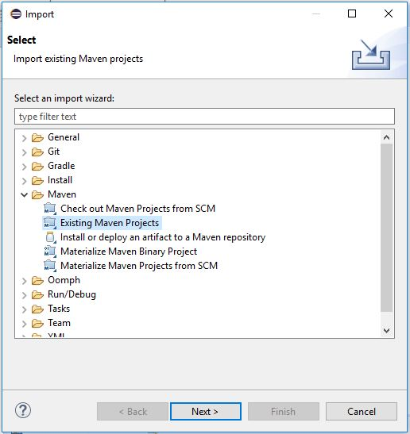
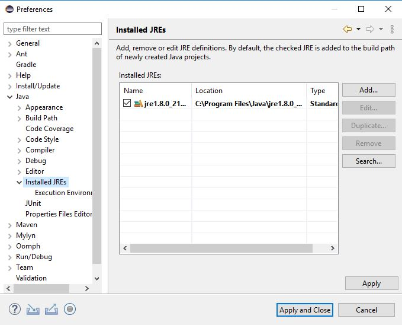

# Coding Challenge Application 

### Background

The solution of coding challenge is implemented using Java 8u211 64bits with Apache Maven. The editor used to write the solution is Eclipse.

An Internet connection is required to download the dependency libraries and the coding challenge data.

### How to install

This application is created with Apache Maven. The Apache Maven can be downloaded from  https://maven.apache.org/download.cgi.  If you do not have a Java JDK installed on your system, you can download it from https://www.oracle.com/java/technologies/javase/javase-jdk8-downloads.html and install it to _&lt;JDK directory&gt;_.

 
 
To clean and package the files, plug-ins, and libraries before running the application:

% *set JAVA_HOME=&lt;JDK directory&gt;*

% *mvn clean package*

 
 
To run the application using Maven:

% *mvn exec:java -Dexec.mainClass=org.codingChallenge.kogan.Driver*

 
 
To run the application by executing the JAR file directly:

% *cd target*

% *java -cp kogan-0.0.1-SNAPSHOT-jar-with-dependencies.jar org.codingChallenge.kogan.Driver*

### How to setup Eclipse editor.

1. Download eclipse from: https://www.eclipse.org/downloads/download.php?file=/technology/epp/downloads/release/2020-03/R/eclipse-java-2020-03-R-win32-x86_64.zip

2. Extract the Eclipse zip file into a directory.

3. Run the eclipse.exe in the extracted directory.

4. A dialog window will pop-up asking a workspace directory. The default workspace directory is C:\Users\ _&lt;user&gt;_\eclipse-workspace

5. For simplicity, we use the default directory.

6. Extract the solution zip file into the eclipse workspace directory.

7. As the solution uses Maven, we will import it as a Maven Project. _File -&gt;Import_. The import window appears. Select _Maven-&gt;Existing Maven Projects_ 

   In _Root directory_ field, select the extracted _solution_ (*&lt;workspace\_dir&gt;\kogan*) directory.  Once the _Root directory_ is selected, the _projects_ text field will show */pom.xml* and it will be checked. Then click *Finish* button.

8.  By default, Eclipse 2020-03 will search a JRE installed locally. If you want to compile the source code, a JDK directory needs to be included in the *Installed JREs*. To do this, select *windows-&gt;preferences*. A *Preferences* window will appear (as shown below). 

   Click *Add* button and choose *Standard VM*.  Click *Next* button. 

   The *Add JRE* window will appear. Click *Directory* button and select the *&lt;JDK directory&gt;*. Once the JDK directory is selected, a list of files will be populated in *JRE System libraries* area. Click *Finish* button. The previous window will be shown with the newly added JDK directory. Check the newly added JDK directory. Then click *Apply and Close*. 

   

### 